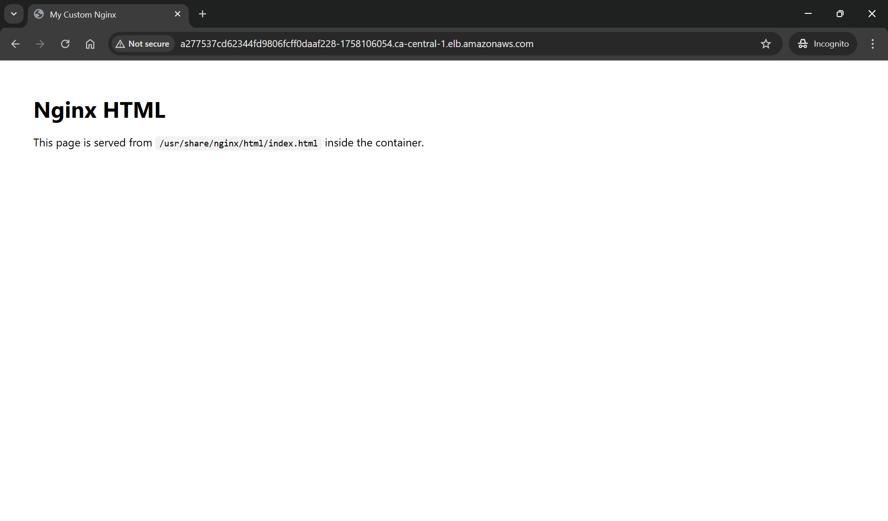

# Terraform Demo: AWS EKS

- [Terraform Demo: AWS EKS](#terraform-demo-aws-eks)
  - [Application - nginx](#application---nginx)
  - [Infrastructure - Terraform(AWS)](#infrastructure---terraformaws)
  - [K8s](#k8s)

---

## Application - nginx

```sh
cd ./app/nginx

# build image
docker build -t demo-nginx .
# Test image locally
docker run -d --rm --name demo-nginx -p 8080:8080 demo-nginx
# remove container
docker rm -f demo-nginx

# tag image
docker tag demo-nginx simonangelfong/demo-nginx-public
# push image
docker push simonangelfong/demo-nginx-public
```

---

## Infrastructure - Terraform(AWS)

- Create resources

```sh
cd app/aws

# init
terraform init -backend-config=backend.config

# plan and deploy
terraform plan
terraform apply -auto-approve

# output command
terraform refresh
# Outputs:
# aws_eks_command = "aws eks update-kubeconfig --region ca-central-1 --name tf-demo-eks-web-app-eks"

# # remove resources
# terraform apply -destroy
```

- Add eks context to local config

```sh
# list available contexts
kubectl config get-contexts
# CURRENT   NAME             CLUSTER          AUTHINFO         NAMESPACE
# *         docker-desktop   docker-desktop   docker-desktop

# show current context
kubectl config current-context
# docker-desktop

# update kubeconfig: create or update eks context
aws eks update-kubeconfig --region ca-central-1 --name tf-demo-eks-web-app-eks
# Added new context arn:aws:eks:ca-central-1:id:cluster/tf-demo-eks-web-app-eks to ~\.kube\config

# list context
kubectl config get-contexts
# CURRENT   NAME                                                                    CLUSTER
#               AUTHINFO                                                                NAMESPACE
# *         arn:aws:eks:ca-central-1:id:cluster/tf-demo-eks-web-app-eks   arn:aws:eks:ca-central-1:id:cluster/tf-demo-eks-web-app-eks   arn:aws:eks:ca-central-1:id:cluster/tf-demo-eks-web-app-eks
#           docker-desktop                                                          docker-desktop
#               docker-desktop

# list eks node
kubectl get nodes
# NAME                                          STATUS   ROLES    AGE   VERSION
# ip-10-0-1-137.ca-central-1.compute.internal   Ready    <none>   24m   v1.33.5-eks-113cf36

# list eks node cpu and memory
kubectl get nodes -o custom-columns=Name:.metadata.name,nCPU:.status.capacity.cpu,Memory:.status.capacity.memory
# Name                                          nCPU   Memory
# ip-10-0-1-137.ca-central-1.compute.internal   2      3926552Ki
```

- Test: create resource within the eks context

```sh
# Create an Nginx instance
kubectl run --port 80 --image nginx nginx
# pod/nginx created

# confirm
kubectl get pods
# NAME    READY   STATUS    RESTARTS   AGE
# nginx   1/1     Running   0          9s

# test pod locally
kubectl port-forward nginx 3000:80
# test locally: http://localhost:3000

# delete test pod
kubectl delete pod nginx
```

- Remove eks context

```sh
# switch context to default context
kubectl config use-context docker-desktop
# Switched to context "docker-desktop".

# remove context
kubectl config delete-context context_name
# deleted context arn:aws:eks:ca-central-1:id:cluster/tf-demo-eks-web-app-eks from ~\.kube\config

# confirm
kubectl config get-contexts
# CURRENT   NAME             CLUSTER          AUTHINFO         NAMESPACE
# *         docker-desktop   docker-desktop   docker-desktop
```

---

## K8s

- Deploy workload

```sh
kubectl create -f ./app/k8s/
# kubectl delete -f ./app/k8s/

# get endpoint
kubectl get svc nginx-svc-lb
# NAME           TYPE           CLUSTER-IP       EXTERNAL-IP
        # PORT(S)        AGE
# nginx-svc-lb   LoadBalancer   172.20.172.239   a277537cd62344fd9806fcff0daaf228-1758106054.ca-central-1.elb.amazonaws.com   80:31103/TCP   8m50s

# test
curl http://a277537cd62344fd9806fcff0daaf228-1758106054.ca-central-1.elb.amazonaws.com
```

- http website



- Clean up

```sh
kubectl delete svc nginx-svc-lb
# service "nginx-svc-lb" deleted from default namespace
```
